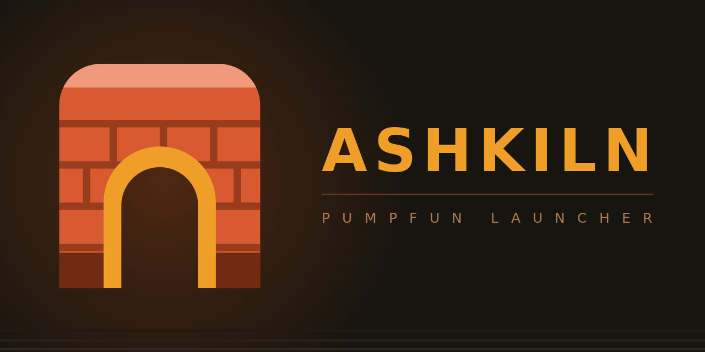
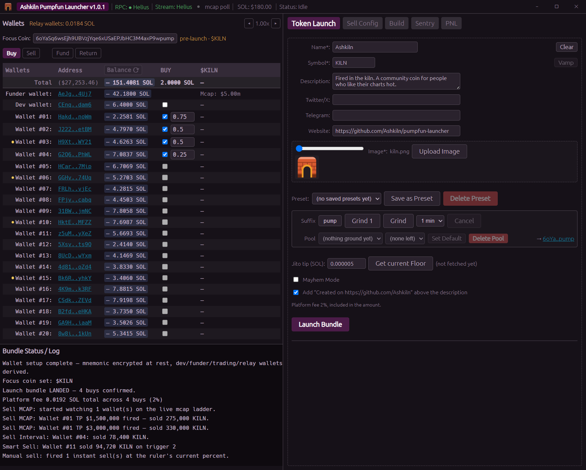

  

# Ashkiln Pumpfun Launcher

**Launch a pump.fun coin and buy it in the same block, then let it sell itself.**

A Windows desktop app for launching and trading pump.fun coins from your own machine. It creates
the coin, buys it from several of your wallets inside one atomic bundle, and then runs your exit
for you, market cap ladders, timed sells, or a rule engine on a live price feed. Your keys are
generated on your computer and never leave it.

## Features

- **Your launch buy lands with the launch.** The create and up to four wallet buys go out as one
  Jito bundle. Either all of it lands or none of it does, no half executed launch.
- **A whole wallet set from one phrase.** A funder, a dev wallet and 20 trading wallets, all
  derived from a single 12 word recovery phrase you write down once.
- **Exits that run while you're away.** Take profit and stop loss rungs on live market cap, timed
  ladders, and a rule builder that reads a live price stream.
- **Set a launch up now, fire it later.** Record a launch and its sell plan, pick a time, and
  Sentry fires it for you.
- **Cycle a coin across your wallets.** Bunch Mode buys and sells the same coin repeatedly, keeps
  every wallet's own books, and steers by a goal you pick, at a tenth of the usual fee.
- **Nothing to sign up for.** Image and metadata hosting is free and built in. You need an RPC
  endpoint and nothing else.
- **A straight answer on profit.** The PNL tab reads your real wallet balances rather than adding
  up what the app thinks it did.
- **Get your rent back.** One button closes empty token accounts and returns the SOL to the wallet
  that paid it.
- **Make it look how you want.** Seven built in themes, or derive your own from a background and an
  accent colour, fonts, spacing and corners included.

## Download

**[Download the latest release →](https://github.com/Ashkiln/pumpfun-launcher/releases/latest)**

Windows 10 or 11, 64 bit. See [Installation](docs/installation.md).

## What it costs

No subscription, no licence key, no per launch charge. A platform fee on trades, and nothing else.

| | Rate |
|---|---|
| Buys | **2%** |
| Sells | **1%** |
| Bunch Mode buys / sells | **0.20% / 0.10%** |

**The fee is included, never added on top.** A 1 SOL buy costs 1 SOL in total. And it rides inside
the same transaction as the trade, so **a trade that fails is never charged**, there is no state
where the fee was taken and the trade did not happen.

**Why the sell fee is 1% on average rather than 1% exactly.** A buy names the SOL it spends, so its
2% is exact arithmetic. A sell names *tokens*, and what comes back is decided on chain after the
transaction is already signed, so the fee has to be fixed before anyone knows the answer. It works
out at **0.95% of the venue's quote**, a shade under the headline 1% because it allows for
pump.fun's own cut and for the price moving before the sell lands.

Two consequences, and both are worth knowing before you see them:

- **Your slippage setting does not change what you pay.** The figure is taken from the quote, not
  from your slippage floor. Two sells of the same size at 10% and 40% slippage were measured
  charging an identical fee, to the lamport.
- **A good fill costs you under 1%. A bad one costs over.** On a coin with normal volume the fill
  lands close to the quote and the fee works out at about **0.96%** of what you actually received.
  That is a measured figure, not an estimate. On a thin coin, or a large sell, or several wallets
  selling at once, the fill can come in below the estimate and the same fee then works out above
  1%. **A high slippage setting is a limit, not a prediction**, setting it to 40% does not mean
  you fill 40% down.

It is designed to average out at the headline rate across many sells, not to land on it every time.
[Full detail, with the arithmetic](docs/faq.md#what-does-it-cost-to-use).

On top of ours, and not received by us: pump.fun's own fee, Solana network fees, your priority fee,
your Jito tip, and account rent.

## Is this safe to run?

Fair question, you are about to run an unsigned program that handles private keys. Here is exactly
what happens.

**Your keys are made on your machine and stay there.** At first run the app generates a 12 word
BIP-39 recovery phrase using your operating system's cryptographic random generator. Every wallet
comes from that phrase. No key and no phrase is ever sent anywhere.

**Your phrase is written to disk, and it is encrypted.** It is stored as `settings/seed.enc`
using AES-256-GCM, with the encryption key derived from your passphrase by Argon2id and a random
salt. Every wallet's private key is worked out from that phrase in memory when you unlock, so no
derived key is ever put in a file. A wrong passphrase fails cleanly; it cannot return the wrong
keys.

**A key you import yourself works differently, and it is worth knowing why.** If you import a
private key for the funder or dev wallet, nothing can work that key out from your phrase, so the app
keeps the key itself, encrypted the same way. The consequence that matters: your 12 words restore
every wallet the app derived, but they will not restore an imported one. Keep your own copy of it.

**You alone hold the recovery phrase.** It is shown once during setup and you confirm three words
back before continuing. Nobody, including us, can recover it or reset it for you. It uses the
standard Solana derivation path, so the same phrase opens in Phantom or Solflare if you ever need
it to.

**The installer is not code signed yet, and Windows will say so.** SmartScreen shows
*"Windows protected your PC"*. Click **More info**, then **Run anyway**.

**Verify the download if you want to.** Every release page lists the SHA-256 checksum of its
installer. Run `Get-FileHash` on the file you downloaded and compare, the steps are in
[Installation](docs/installation.md#checking-the-download-optional).

**The app reports anonymous usage counters, and here is what that means.** It checks in for its
configuration and for updates, and that check in carries a small set of numbers: how many times each
feature was used, and whether the app crashed. That is how a bad build gets caught before it costs
you money. **Your wallet addresses, the coins you trade, your amounts, your RPC endpoints, your API
keys and your recovery phrase are never part of it, and there is no separate analytics server.**
Settings → About shows you the exact file on your machine holding exactly what would be sent, not a
summary of it, the file. There is no opt out switch in this version.

## Documentation

| | |
|---|---|
| [Installation](docs/installation.md) | Download, SmartScreen, where your files live |
| [Getting started](docs/getting-started.md) | First run through to your first sell |
| [Wallets](docs/wallets.md) | The recovery phrase, funding, backups, the reserve |
| [Launching](docs/launching.md) | Metadata, bundling, what happens on chain |
| [Sell ladders](docs/sell-ladders.md) | Take profit and stop loss, with a worked example |
| [Troubleshooting](docs/troubleshooting.md) | What the errors mean and what to do |
| [FAQ](docs/faq.md) | Fees, Mac and Linux, graduation, key safety |

## Support

Questions, bug reports and feature requests:
**[GitHub Discussions](https://github.com/Ashkiln/pumpfun-launcher/discussions)**

## Risk

**This app trades real money automatically, and you can lose it.**

pump.fun coins are extremely high risk. Most of them go to zero. Automated selling can fire at a
price you did not expect, and a plan that looked sensible when you set it can execute into a market
that has moved.

Failed and reverted transactions still cost network fees. A launch that does not land, a buy that
gets outbid, a sell that reverts on slippage, each of those can cost SOL and return nothing.

Every trade this app makes is one you set up and started. You are solely responsible for your own
trades, your own coins, and your own funds. Nothing here is financial advice.

The software is provided **as is**, with no warranty of any kind. We are not liable for lost funds,
missed sells, failed launches, or any other loss arising from using it.
