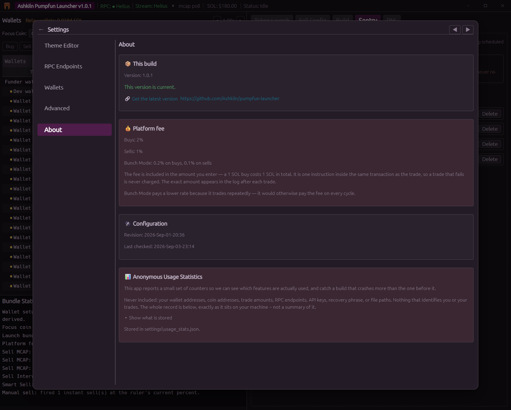

# FAQ

## What does it cost to use?

There is a platform fee on trades, and nothing else. No subscription, no per launch charge, no
licence key.

| | Rate |
|---|---|
| **Buys** | 2% |
| **Sells** | 1% |
| **Bunch Mode buys** | 0.20% |
| **Bunch Mode sells** | 0.10% |

Bunch pays roughly a tenth of the standard rate because it cycles, it would otherwise pay the fee
on every round trip.

### The fee is included, never added on top

**A 1 SOL buy costs 1 SOL in total.** Type 0.1 SOL and 0.098 buys tokens while 0.002 is the fee. It
is not charged on top of what you typed, and it never changes what a wallet is debited.

### If the trade fails, you are not charged

The fee is a single instruction *inside the same transaction* as the trade. Solana transactions are
atomic, so if the swap reverts, the fee reverts with it. There is no state where the fee was taken
and the trade did not happen, which is also why there is no accrual, no settlement and no refund
process.

### How the sell fee is calculated, and why it is 1% *on average*

**A buy is exact.** It names the SOL it spends, so the fee is 2% of a number you typed. Nothing is
estimated.

**A sell cannot be.** You name a *token* amount, and what comes back is decided on chain, after the
transaction is signed. The fee instruction is inside that same transaction, so it has to carry a
number before anyone knows the answer.

So the sell fee is **0.95% of the venue's quote**. The 1% is charged not against the whole quote but
against the app's estimate of what the sell will actually deliver, which is 5% less.

#### Where the 0.95 comes from

Two things sit between the quote and what you net, and only one of them is known:

- **pump.fun's own cut**, which is known: 1.25% on the bonding curve, 0.30% on PumpSwap. The quote
  is taken before it, so you never receive the full quote on either venue.
- **The price moving before the sell lands**, which is not. And it is not symmetric noise: sells
  cluster on falling prices, and this app can dispatch several wallets at once against one set of
  reserves, so the later fills in a group land measurably below the quote all of them were priced
  from.

That 5% is the venue's 1.25% plus roughly 4% of allowance for the price moving. One constant covers
both venues, which means a graduated coin, where there is less to allow for, is charged a shade
under the headline rate.

#### Your slippage setting does not change what you pay

This is worth stating plainly, because it used to work the other way round and it was wrong.

The fee is taken from the **quote**, not from your slippage floor. Two sells of the same position
size, one at 10% slippage and one at 40%, were measured charging **an identical fee, to the
lamport**. Moving that field cannot make your fee bigger or smaller.

**And a high slippage setting is a limit, not a prediction.** Setting it to 40% does not mean you
fill 40% below quote, it means you are willing to accept it if you do. Most of the time you will
not.

#### What that means in practice

Say the quote for the tokens you are selling is **1.000 SOL**. The fee is 0.95% of that, so
**0.0095 SOL, fixed, whatever your slippage is set to.** What changes is what you receive:

| What actually lands | Why | Fee | Effective rate |
|---|---|---|---|
| 0.9875 SOL | Normal fill on a coin with volume, just pump.fun's 1.25% | 0.0095 | **0.96%** |
| 0.95 SOL | 5% below quote | 0.0095 | **1.00%**, break even |
| 0.90 SOL | 10% below quote | 0.0095 | **1.06%** |
| 0.80 SOL | 20% below quote | 0.0095 | **1.19%** |

**The normal case is the first row.** On a coin trading with reasonable volume, a sell lands close
to quote and the fee works out at about **0.96% of what you actually received**, that is a measured
live figure, not a projection. **Under 1%, not over.**

You pay more than 1% when the fill genuinely comes in worse than the estimate: a thin or dying coin,
a sell large relative to the liquidity, or several of your own wallets selling into the same
reserves at once.

**It is built to average out at 1% across many sells, not to land on 1% every time.** Charging
against the guaranteed floor instead would put it permanently *below* the headline rate and let your
slippage setting decide the number, which is exactly what it used to do, and why it changed.

#### The hard ceiling

A sell's fee can never exceed **a quarter of the proceeds the swap guarantees**. At any normal
slippage this is nowhere near binding, it takes a setting above about 96% to reach it. It exists so
that no combination of quote and slippage can size a fee the sell cannot afford to pay, because a
fee that cannot be paid would revert the sell itself.

### The small print

- If the calculated fee comes out **below 0.000001 SOL, no fee is charged at all**.
- Rates can be updated remotely, but only within limits compiled into the app that no configuration
  can exceed: buys and sells can never go below 1% or above 5%, and never above 6% combined. Bunch
  is capped at 1% per side and 1.5% combined. Zero is not reachable either, a published rate below
  the floor is raised to it. If a rate ever changes, the app tells you and asks you to acknowledge
  it before you trade.
- **Settings → About** always shows the rates actually in force, and every trade writes the exact
  amount into the log, `Platform fee 0.0002 SOL (2%)`.

### What we do not receive

pump.fun's own fee (1.25% on the bonding curve, 0.30% on PumpSwap), Solana network fees, your
priority fee, your Jito tip, and account rent. Those are the network's and the venue's. Budget for
them separately, the account rent in particular is around 0.007 SOL the first time a wallet touches
a new coin.

---

## Does it run on Mac or Linux?

No. Windows 10 and 11, 64 bit, only. It is a native Windows application and there is no Mac or Linux
build.

It has not been tested under Wine or Parallels and we cannot support it there. Do not put real funds
on an untested setup.

---

## What happens when a coin graduates?

Nothing you have to do. The app checks a coin's graduation status before every trade and routes to
the right venue: the pump.fun bonding curve before graduation, **PumpSwap** after it. If a sell
fails because the coin graduated in between, it checks again and retries on the new venue by itself.

Your running sell ladders keep working across graduation.

One limitation: **only SOL paired pools are supported.** A graduated coin paired against something
other than SOL will report that it cannot be traded, rather than trading it wrong.

---

## Can I close the app while a sell ladder is running?

**No.** Sell jobs, market cap watchers and Bunch runs all live inside the app. Closing the window
stops them, and nothing resumes when you reopen it.

The same applies to Sentry: it cannot fire a scheduled launch while the app is closed or locked,
because signing needs your passphrase held in memory. An unattended launch means an unlocked app
left running.

If you need to stop trading but keep the app open, use the Stop buttons on the individual jobs.

---

## Is my private key safe?

**Nothing leaves your machine.** No key, no recovery phrase, no passphrase is ever transmitted
anywhere, by any code path.

Here is exactly what is stored and how:

- **Your 12 word recovery phrase** is encrypted with **AES-256-GCM**. The encryption key is derived
  from your passphrase using **Argon2id**, a deliberately slow, memory hard function, with a
  random 16 byte salt and a random 12 byte nonce generated fresh for every write. The result is
  `settings\seed.enc`.
- **No derived private key is put in a file.** Every wallet the app derives is worked out again
  from the phrase in memory each time you unlock, and the decrypted material is wrapped so it is
  wiped when it is dropped.
- **A key you import yourself is stored**, because nothing can work it out from your phrase. It
  goes in `settings\.env` under the same AES-256-GCM and Argon2id as the phrase. It is protected
  just as well; the difference is that your 12 words will not bring it back, so keep your own copy.
- **Authentication is built in.** A wrong passphrase, or a single altered byte in the file, fails
  cleanly rather than returning wrong keys.
- **Your RPC URLs and any API keys** in `settings\.env` are encrypted the same way.

Two things are deliberately **not** encrypted, and it is worth knowing why:

- **Ground vanity mint addresses** in the `vanity` folder. A mint keypair signs one create
  instruction and controls nothing afterwards. The real risk is somebody learning an address you are
  about to launch.
- **Files you export yourself** through Settings → Advanced → Export Wallets. That is a plain key
  file, on purpose, because its whole job is to be importable elsewhere. Delete it when you are
  done.

**Keep the whole install folder off shared drives and out of synced folders** like OneDrive or
Dropbox. Whoever has that folder has your encrypted wallet file, and only your passphrase stands
between them and it.

---

## Can I use my existing Phantom wallet?

You can, but **do not**. This app derives dozens of accounts from whatever phrase you give it,
funder, dev, 20 trading wallets, 20 relay wallets, and treats every one of them as its own. Point
it at a personal wallet's phrase and it will happily start funding and trading from addresses you
use elsewhere.

Use a phrase created for this app and nothing else. The setup screen says the same thing.

Going the other way is fine: because the app uses the standard Solana derivation path, any address
it makes can be opened in Phantom or Solflare from the same phrase.

---

## Can I move my install to another PC?

Yes. Copy the whole program folder. The encryption comes from your passphrase alone, never from
anything about the machine, so it will unlock on the new PC exactly as it did on the old one.

That is also why you should treat the folder like a wallet backup.

---

## How do updates work?

The app checks for updates on its own. When one is available, an **Update** button appears in the
top bar; pressing it downloads, installs and restarts. Your wallets and settings are untouched.

If a launch, a sell job or an armed Bunch run is going, the update is refused until it
finishes rather than interrupting it.

---

## Does the app phone home?

It checks in periodically for its configuration and for update availability. That check in also
carries a small set of anonymous counters, how many times each feature was used, and whether the
app crashed, so a broken build can be spotted before it costs people money.

**Settings → About** shows you the exact file, on your machine, containing exactly what would be
sent, the same card pictured under *What does it cost to use?* above. No wallet address, coin address, trade amount, RPC endpoint, API key or file path is in it.
There is no separate analytics server and no second host is ever contacted.

---

## How many wallets can buy in a launch?

Four trading wallets, or three plus the dev wallet if the dev buys too. That is a hard limit of the
bundle: five transactions, one of which is the create.

More wallets can buy immediately afterwards through Manual Buy, which sends individual transactions
and has no such limit.

---

## Why is there a 0.01 SOL minimum?

Because below it, the network costs more than the trade. The first time a wallet buys a new coin it
pays around 0.004 SOL just to open its token account. The minimum is checked when you type an
amount, never at the moment of sending, a refusal at send time would kill a trade you could no
longer do anything about.

---

## Do I need a Pinata or IPFS account?

No. Images and metadata upload free to Arweave, with no account and nothing to configure. Pinata is
available in Settings → Advanced if you would rather use a service you control, but a fresh install
can launch without pasting anything in.

---

## Do I need to configure Jito?

No. Bundle relay regions and access are built in.

---

## Which RPC provider should I use?

A free Helius or QuickNode key covers everything including the live WebSocket stream that Smart Sell
needs, and handles a full 20 wallet pool comfortably. Solana's own public nodes work for looking
around but throttle too hard to launch on. If you are trading real size, pay for one.

**Settings → RPC Endpoints → "New here?"** lists the options with links, and every endpoint row has
a **Test** button that tells you what that endpoint can actually do.
