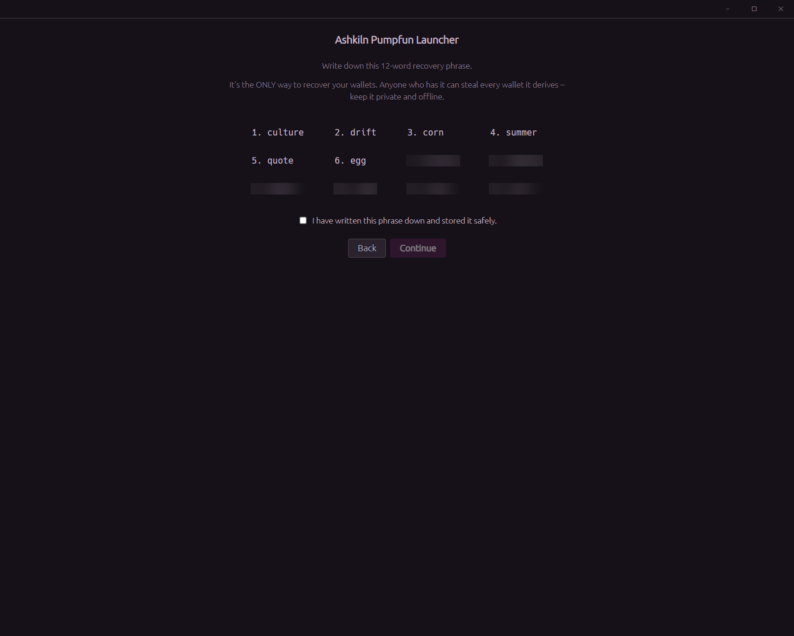
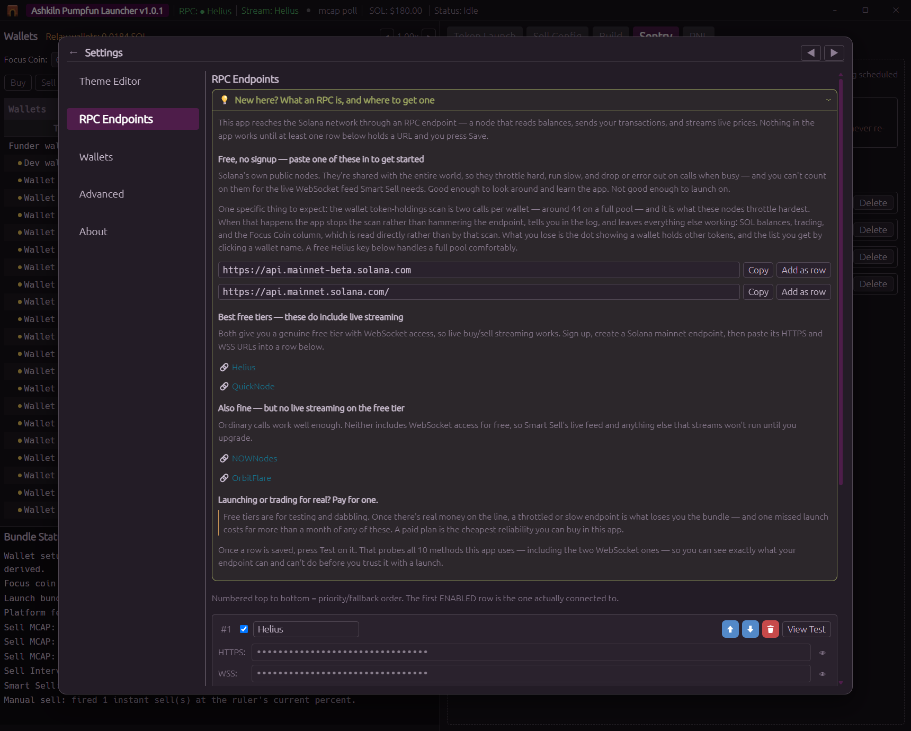
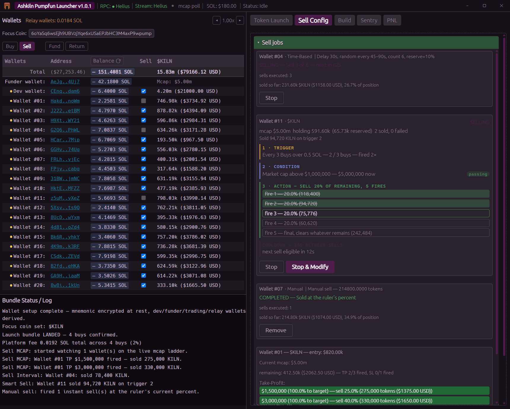
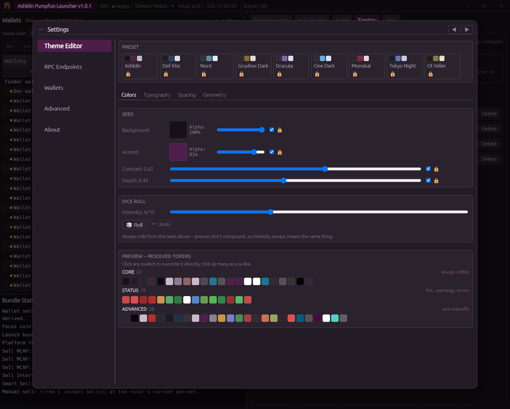

# Getting started

This walks you from a fresh install to your first launch and your first sell. Read it once before
you spend anything, a launch is permanent and cannot be undone.

## 1. Create your wallet

The first time you open the app there is no wallet on the machine, so it offers you two choices:

- **Create New Wallet**, makes a brand new 12 word recovery phrase.
- **Recover Existing 12 Word Phrase**, restores one you already have.

Choose **Create New Wallet**.

### Write the phrase down

Twelve words appear. **Write them on paper.** Not a screenshot, not a text file, not a password
manager sync you don't control.

That phrase is your wallets. Anyone who has it can take every coin and every SOL in every wallet
this app derives. Nobody can recover it for you, not us, not anyone.

Tick the box, press **Continue**, and the app asks you to type three of the words back to prove you
really wrote them down.

### Choose a passphrase

The passphrase encrypts the phrase on this machine. You type it every time you open the app.

The passphrase and the phrase do different jobs, and it is worth being clear about which:

- **Lose the passphrase**, annoying but survivable. Recover from your written down 12 words and set
  a new one.
- **Lose the 12 words**, permanent. There is no reset.

**A strength meter sits under the button, and it is a gate, not a hint.** A five segment bar runs
from *Very Weak* to *Very Strong*, and **you cannot continue until it reaches "Fair"**, the
button stays disabled below that.

**A passphrase cannot contain spaces.** Type one and it is removed as you type, with a brief note
saying why. The same applies everywhere the app asks for your passphrase. A space is invisible in a
field of dots, so a passphrase that ends with one looks exactly like the same passphrase without
it, and nothing can tell you which you typed.

It is not counting capitals and symbols. It scores against dictionaries, names, dates, keyboard
walks and common substitutions, so `P@ssw0rd123!` scores badly and four unrelated ordinary words
score well. A line under the bar tells you what is weak about what you typed, and a caption
estimates how long the passphrase would take to break offline.

This is the only thing standing between your encrypted wallet file and anyone who ends up with a
copy of it. Take the extra ten seconds.

Press **Encrypt & Continue** and the app builds your wallet set: a funder, a dev wallet, 20 trading
wallets and their relay wallets. See [Wallets](wallets.md) for what each one is for.

> **Recovering instead?** Only use a phrase created for this app. Do not paste in the seed phrase
> from a personal wallet you use elsewhere, this app derives dozens of accounts from whatever
> phrase you give it and treats all of them as its own.

## 2. Add an RPC endpoint

**Nothing works until you do this.** An RPC endpoint is the node the app talks to for reading
balances, sending transactions and watching prices.

Open **Settings** (the kiln icon, top right) → **RPC Endpoints**. Expand
**"New here? What an RPC is, and where to get one"** and it lays out the options:

- **Solana's own free public nodes**, nothing to sign up for. Fine for looking around. They
  throttle hard and are not good enough to launch on.
- **A free tier with WebSocket access** (Helius, QuickNode), this is what most people should use.
  Sign up, create a Solana mainnet endpoint, paste the HTTPS and WSS URLs into a row, press
  **Save**. A free key handles a full wallet pool comfortably and gives you the live streaming that
  Smart Sell needs.
- **Paid**, if you launch or trade for real money, buy one.

There is a **Test** button on every row. It checks ten methods against the URL you typed and tells
you what that endpoint can and cannot do, in about a second.

## 3. Put SOL in the funder

The **Wallets** panel on the left lists every wallet with its address and balance.

Copy the **funder** address and send SOL to it from wherever you keep it. The funder is the wallet
that pays for everything else.

Press **Refresh Balances** and the SOL appears.

## 4. Fund the trading wallets

In the Wallets panel, switch to **FUND** mode. Tick the wallets you want to use, type an amount for
each, and send. The funder pays them.

Two numbers to know before you do:

- **The minimum trade is 0.01 SOL.** Any buy or sell below that is refused. Fund each wallet with
  meaningfully more than that.
- **Each wallet keeps a small buffer back** (0.01 SOL by default) so it can still pay its own
  network fees and account rent when it sells later. The BUY column clamps against it automatically
  and tells you the maximum you can actually spend.

## 5. Launch a coin

Go to the **Token Launch** tab.

1. **Fill in the coin.** Name, ticker, description, and an image (drag and drop works). Socials are
   optional. There is no account to set up for hosting, the image and metadata are uploaded free.
2. **Arm a mint address.** In the vanity card, type a 1 to 4 character suffix and press **Grind 1**, or
   pick one you ground earlier. A short suffix is near instant.
3. **Pick who buys.** Switch the Wallets panel to **BUY**, tick your wallets and type an amount for
   each. A launch bundle carries the create plus up to four wallet buys.
4. **Press Launch Token.** A confirmation dialog names the coin, the mint and the total spend.
   Read it. It is permanent.

The launch goes out as one atomic Jito bundle: either the coin is created and every buy lands, or
nothing happens at all. Progress appears live in the Log panel underneath the Wallets panel.

Once it lands, the new coin automatically becomes your **Focus Coin** and balances refresh. Full
detail: [Launching](launching.md).

## 6. Sell it

The **Focus Coin** is the coin the app is pointed at. It drives everything on the sell side, and a
launch sets it for you.

Go to **Sell Config** and pick how you want to exit:

| Tab | What it does |
|---|---|
| **Sell** | Sells a percentage right now, once. |
| **Sell Interval** | Sells in chunks over time on a schedule you set. |
| **Sell MCAP** | Take profit and stop loss rungs that fire on live market cap. |
| **Smart Sell** | A rule builder on a live price stream. |

Then:

1. In the Wallets panel, tick **SELL** on the wallets holding the coin.
2. Fill in the tab you chose. For a ladder, see [Sell ladders](sell-ladders.md).
3. Set **Reserve** (how much to keep back and never sell), **Slippage** and **Priority fee** in the
   shared section underneath.
4. Press **Start Sell Jobs**.

Running jobs appear in the **Sell jobs** card, one per wallet, with live status. Click its header to
grow it to full screen. You can stop any of them at any time.

You can have **five sell jobs running at once**. Sell jobs run inside the app, if you close the
window, they stop.

## 7. Did it make money?

The **PNL** tab answers that. It reads your actual wallet balances rather than adding up what the
app believes it did, so venue fees, tips and rent are all already in the number.

## Make it look how you want

**Settings → Theme Editor.** Seven built in presets, or build your own: pick a background and an
accent colour, set contrast and depth, and every colour in the app is derived from those. There is a
dice roll if you would rather be surprised, and you can click any individual swatch to override it.

Typography, spacing and corner geometry have their own tabs. Whatever you land on is saved and comes
back next time you open the app.

## Where to go next

- [Wallets](wallets.md), what each wallet is for, funding, backups, the reserve
- [Launching](launching.md), bundling, metadata, Mayhem Mode, what lands on chain
- [Sell ladders](sell-ladders.md), take profit and stop loss with a worked example
- [Troubleshooting](troubleshooting.md), when something refuses to run
