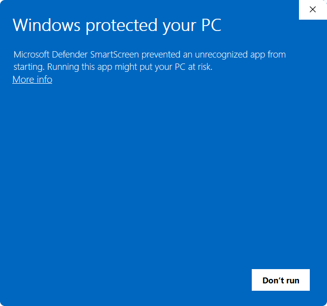
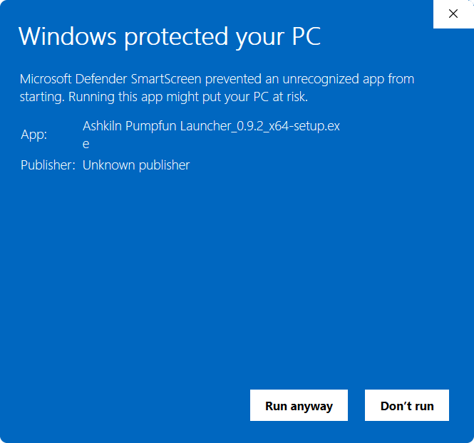

# Installation

## What you need

- Windows 10 or Windows 11, 64 bit.
- A Solana RPC endpoint. The app will not do anything useful without one, see
  [Getting started](getting-started.md). A free one takes about two minutes to set up.
- Some SOL. Everything the app does on chain costs network fees.

You do not need to install anything else first. If the Microsoft Edge WebView2 runtime is missing
from your machine, the installer fetches it for you.

## 1. Download

Get the installer from the
**[latest release](https://github.com/Ashkiln/pumpfun-launcher/releases/latest)**. The file is
named like this:

```
Ashkiln Pumpfun Launcher_1.0.1_x64-setup.exe
```

### Checking the download (optional)

**Every release page lists the SHA-256 checksum of its own installer.** To check the file you
downloaded, open PowerShell in your Downloads folder and run:

```powershell
Get-FileHash "Ashkiln Pumpfun Launcher_1.0.1_x64-setup.exe" -Algorithm SHA256
```

Compare the `Hash` it prints against the one on that release's page. If they match, the file you
have is the file we published. If they don't, delete it and download again.

## 2. Windows will warn you. This is expected.

The installer is not code signed, so Windows SmartScreen shows a blue box saying
**"Windows protected your PC"** with a single **Don't run** button.



To continue:

1. Click **More info**.
2. Click **Run anyway**.



That warning is not a virus detection. It means Windows has not seen this file signed by a
certificate it recognises. A signing certificate costs several hundred dollars a year, and we would
rather say so than hide it. If you want more assurance than that, verify the checksum above before
you run it.

## 3. Where it installs

The installer suggests the root of your system drive:

```
C:\Ashkiln_Pumpfun_Launcher
```

You can change it to anywhere you like **except Program Files**. The installer will stop you from
choosing that, on purpose:

> This app keeps its data, including your wallets, in its own folder, next to the program.
> Windows makes Program Files read only for normal programs, so an install there could not write
> its own settings and the app would refuse to start.

It installs for your Windows user only. No administrator prompt, nothing added system wide.

You get a Start menu shortcut and a desktop shortcut.

## 4. First run

Double click the shortcut. The app opens on a setup screen because there is no wallet on this
machine yet.

Do not rush this screen, it is where your recovery phrase is created and shown to you exactly
once. [Getting started](getting-started.md) walks through it.

## Where your files live

Everything the app owns sits inside the install folder. There is nothing in AppData, nothing in the
registry beyond the uninstall entry, and nothing in a hidden user profile folder.

```
C:\Ashkiln_Pumpfun_Launcher\
  Ashkiln Pumpfun Launcher.exe
  settings\            your wallet file, config, RPC endpoints, saved theme
    seed.enc           ← your encrypted recovery phrase. This IS your wallets.
    wallet_meta.json   which wallet slots you are using
    .env               RPC endpoint URLs and any API keys, encrypted
    config.toml        app settings
  presets\             saved token metadata presets
  builds\              recorded Builds (see Launching)
  exports\             wallet key exports you asked for
  vanity\             pre-ground vanity mint addresses
  logs\                bundler.log and crash.log
```

**This makes the whole install portable.** Copy the folder to another drive or another PC and it
works there, wallets and all, the encryption is derived from your passphrase, never from your
machine. That also means anyone who copies that folder has your encrypted wallet file, so treat it
the way you'd treat a wallet backup.

## Updating

The app checks for updates on its own and offers an **Update** button in the top bar when one is
available. Press it and the app downloads the new version, installs it and restarts itself. Your
wallets, settings and saved presets are untouched.

If a launch in flight, a sell job or an armed Bunch run is going, the update is
refused until it finishes, rather than being interrupted halfway.

## Uninstalling

Use **Add or remove programs**, or `uninstall.exe` in the install folder.

**Uninstalling does not delete your wallets.** They live in the `settings` folder and stay there.
The uninstaller offers a checkbox to clear a separate Windows settings folder; that folder does not
contain your wallets either way.

If you want them really gone, delete the install folder yourself afterwards, and understand that
without your written down recovery phrase, that is permanent. Write it down first:
**Settings → Advanced → Recovery Phrase**.
