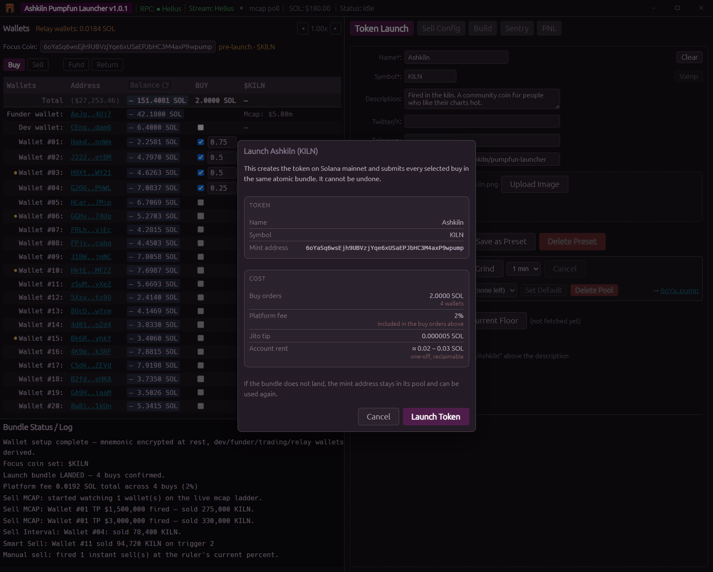
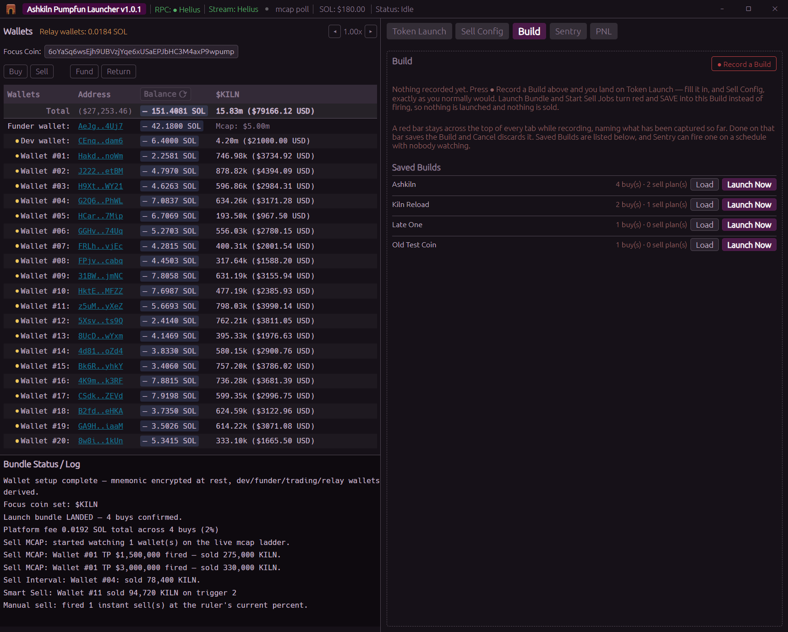
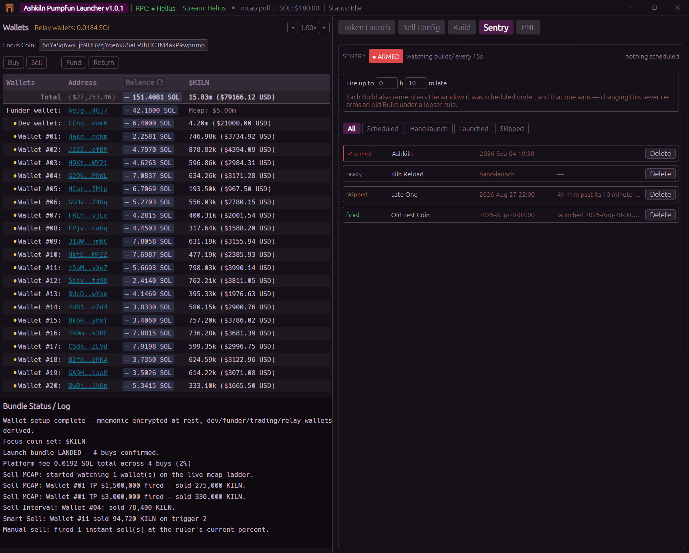

# Launching a coin

## What a launch actually is

The app creates your coin on pump.fun and buys it from your wallets **in the same atomic bundle**.
That is the whole point: nobody gets between the create and your buys, and there is no half finished
state. Either the coin exists and every buy landed, or nothing happened and you were not charged for
it.

A bundle holds five transactions. One is the create, so:

- **Up to 4 trading wallets** can buy in the launch, or
- **3 trading wallets plus the dev wallet**, if the dev buys too.

More wallets than that buy afterwards, through Manual Buy.


## Filling in the coin

| Field | Limit | Required |
|---|---|---|
| Name | 32 characters | Yes |
| Ticker / symbol | 10 characters | Yes |
| Description |, | No |
| Image | PNG, JPG, GIF, WEBP or BMP | Yes |
| Twitter/X, Telegram, Website |, | No |

Drag an image onto the panel or click to browse. It is resized and compressed for you, large
photos are scaled down and encoded again so the upload stays small. What you see in the preview is what
gets uploaded.

**Clear** (next to the Name field) empties the whole form and undoes what typing in it did to the
Wallets panel.

### Presets

**Save as Preset** stores the whole form, image included, so you can reuse an identity. Load it from
the dropdown. **Delete Preset** removes one.

### Vamp, copying an existing coin

Copy any coin's mint address to your clipboard and the **Vamp** button lights up. Press it and the
app reads that coin's name, ticker, description, socials and picture and fills your form with them.

It reads the coin on chain and follows its metadata link, so what lands in the form is what a launch
would actually upload. If the image or the metadata document will not load, you get the parts that
did and a plain note about the rest. It never touches your buy amounts, your tip or your Focus Coin
, it copies an identity, not a plan.

## The mint address

Every coin needs a mint address, and this app lets you choose how it ends.

- **Grind 1**, type a 1 to 4 character suffix and grind an address ending in it. One or two
  characters is near instant. Every extra character multiplies the search by 58, which is why four
  is the ceiling.
- **Grind for N minutes**, fills a pool with addresses ending in that suffix so future launches can
  take one off the shelf.
- **Pick from the pool**, arms an address you ground earlier.

Ground addresses live in the `vanity` folder, one small file each. **They are not encrypted**, a
mint keypair signs the create instruction and controls nothing afterwards. The real risk is somebody
seeing an address you are about to launch, so keep the app folder out of a shared or synced drive.

An address is only consumed if the bundle actually lands. A failed launch leaves it in the pool.

## Metadata hosting

Your image and metadata JSON are uploaded to Arweave through ArDrive Turbo, falling back to Irys if
Turbo is unavailable. Both are free and need no account, so a fresh install can launch with nothing
configured.

If you would rather use a service you control, **Settings → Advanced** has a Pinata card. Turn on
"Pinata first" and the free hosts become the backup instead.

## The Jito tip

A field on the Token Launch panel sets the tip that pays for bundle inclusion. The app looks up the
current tip floor for you. Nothing about Jito needs configuring, the regions and access are built
in.

## Mayhem Mode

A checkbox above the Launch button. It sets pump.fun's per coin Mayhem flag: their agent mints
another billion tokens on top of the supply, trades them randomly for 24 hours, then burns whatever
is left.

**It is set at creation and can never be changed afterwards.** Decide before you launch.

## Crediting the launcher

A checkbox above the Launch button, **ticked by default**. Leave it ticked and your coin's
description gets one extra line at the top:

```
Created on https://github.com/Ashkiln
```

Your own description goes underneath it, on its own line, exactly as you typed it. Leave the
description empty and that line is all it says.

**Untick it and nothing is added.** There is no charge either way, turning it off is free and
changes nothing else about the launch.

Like the description itself, this is part of the coin's permanent metadata, so decide before you
launch. If you record the launch as a Build, the setting is recorded with it and the Build fires
with whatever you chose at the time.

## Before you press it

The Launch button stays greyed out and its tooltip tells you the one thing left to fix, in order:

1. No mint armed, grind or pick one.
2. Dev wallet not configured or unlocked.
3. Name and Symbol are required.
4. An image is required.
5. At least one buy is required, switch the Wallets panel to BUY, tick a wallet and enter an amount.
6. A wallet is below the 0.01 SOL minimum. **A launch is a single atomic bundle, so one order below
   the minimum stops all of them.**

**Simulate Create** does a dry run of just the create instruction against the network, without
sending anything. Worth doing on a new setup.

## Pressing Launch

You get a confirmation dialog naming the coin, the mint address, the total across every buying
wallet, and roughly what the on chain account rent will cost on top (~0.02 to 0.03 SOL) plus your tip.
It says plainly that this is permanent.



Then it runs, and each stage reports into the Log panel as it happens:

```
Uploading metadata        - your image and JSON go to Arweave
Fetching fee info         - pump.fun's live fee accounts
Fetching a tip account    - which Jito account to tip
Building launch bundle    - create + every buy, signed
Simulating bundle         - a pre-flight check, where the endpoint supports it
Submitting bundle to Jito - sent
Checking bundle status    - polls for about 40 seconds for a verdict
```

There are three possible verdicts:

- **Landed.** The coin exists. The app sets it as your Focus Coin, refreshes balances so the buys
  show up, consumes the mint from its pool and arms the next one, clears the form and turns BUY mode
  off. A pump.fun link to the coin appears in the log.
- **Unconfirmed.** The 40 second window closed without an answer. The coin may well be live, so the
  app sets the Focus Coin and refreshes anyway, reading the chain is the only way to find out.
  Nothing is cleared, because the next step is usually a retry.
- **Did not land.** Nothing was created and nothing was charged. The Focus Coin is not set, your form
  and your buy selection are kept, and the mint stays in the pool.

> **On the simulation step:** not every RPC endpoint implements bundle simulation. If yours does not,
> the app says so in the log and carries on. That is safe, a Jito bundle is atomic, so a bundle that
> would have failed simply never lands, and never costs you the tip.

## What ends up on chain

- A **Token-2022** mint, created by your dev wallet, which is the coin's on chain creator.
- A bonding curve holding the supply, exactly as any pump.fun coin has.
- One buy per participating wallet, in the same bundle.
- Your metadata on Arweave, permanently.

## Buying more afterwards

Set a coin as the **Focus Coin** and the right hand panel collapses to **Manual Buy**. Tick wallets
in the BUY column, set slippage and priority fee, and buy. These go out as individual transactions
rather than a bundle, so there is no four wallet limit.

This works for any pump.fun coin, not just yours.

## Recording a launch to fire later

**Build Mode** records a whole launch: the coin, the buys, and the sell plan, so it can be fired
later, by you or on a schedule.



1. On the **Build** tab, press **● Record a Build**. A red bar appears across the top.
2. Set the coin up exactly as you normally would. The Launch button now reads **✓ Capture coin +
   buys** and saves instead of firing.
3. Tick wallets, choose a sell tab, fill it in, and press **✓ Capture sell plan**. Repeat with
   different wallets and a different strategy if you want more than one.
4. Press **Done**. The Build saves itself and drops you on the Build tab with the *When* section
   open.

There is no separate form to fill in, you record the real panels, which is why a Build cannot go
stale. Firing one presses the same buttons you would.

**The recorded buy amount is a ceiling, not a promise.** A live buy spends what you typed because
you can see the balance. A Build might fire days later, so each wallet spends the smaller of what
you recorded and what it actually has, minus its sell buffer. A wallet with too little is skipped and
the launch still goes.

## Sentry, firing a Build unattended

The **Sentry** tab lists every Build you have, filtered by scheduled / hand launch / launched /
skipped. Sentry itself is the armed switch at the top.



Its safety rails:

- **Off by default**, and it needs two switches on: the master switch and a per Build tick.
- **It cannot fire while the app is locked.** Signing needs your passphrase in memory, so an
  unattended fire requires an unlocked, running app.
- **It skips anything too late.** You set the grace window in hours and minutes. A Build more than
  that far behind schedule is skipped and logged, rather than launched into a market hours away from
  the one you planned for. Each Build remembers the window that was in force when you saved it.
- **It fires once.** That is written into the Build file, so a restart never fires again it.
- **One at a time.**

Sentry watches the `builds` folder, so a Build file dropped in from outside is picked up on the next
sweep without a restart.
