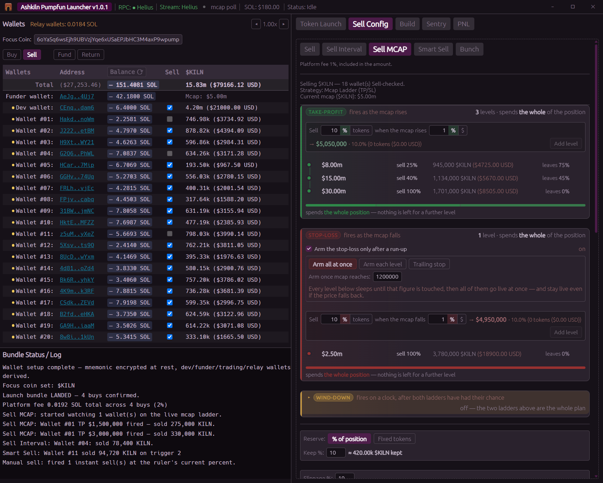
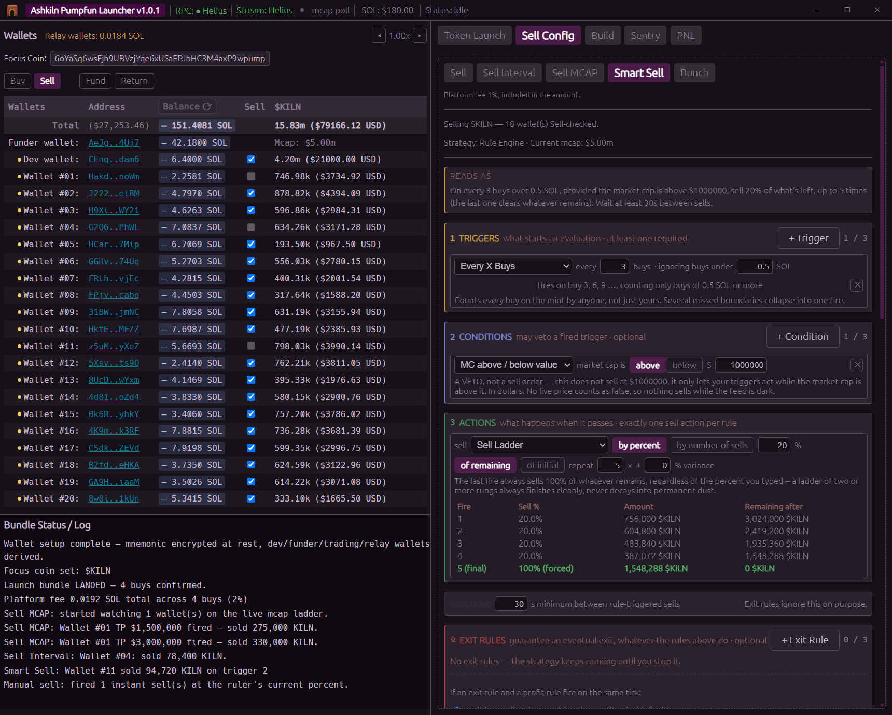
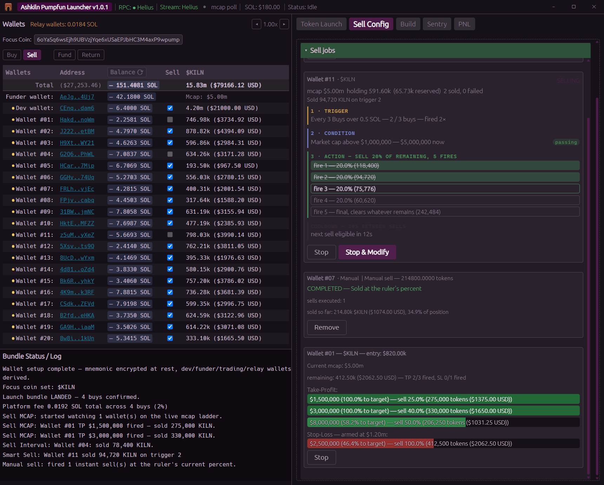
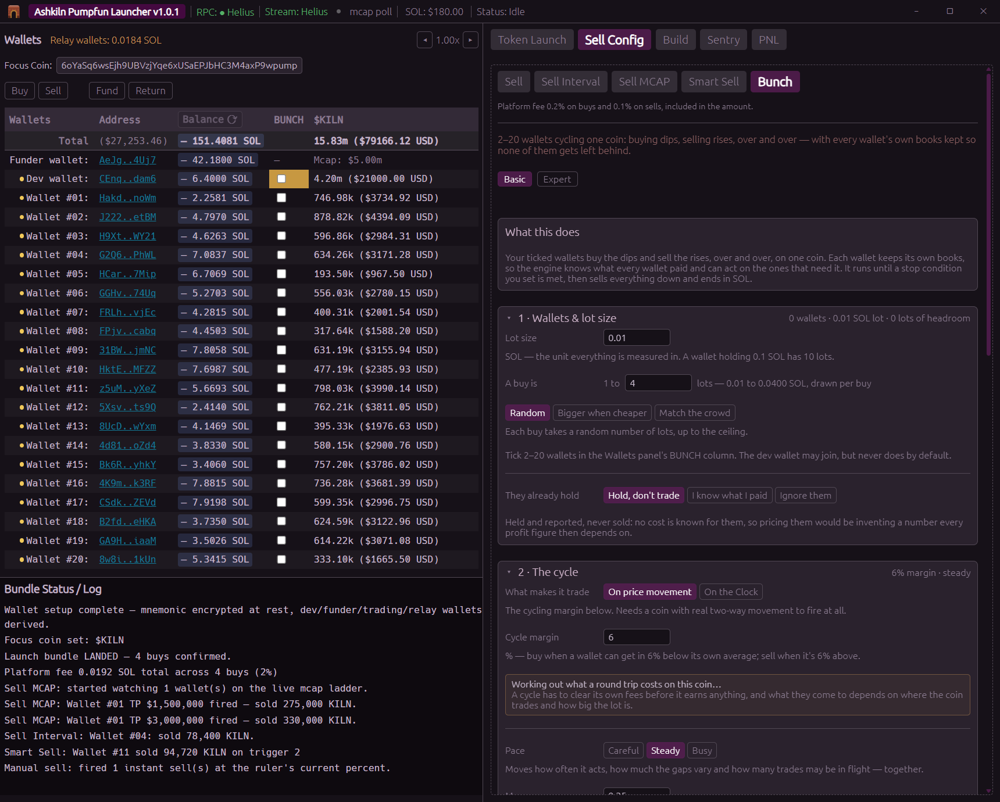

# Selling

Everything on the sell side works on the **Focus Coin**, the one coin the app is pointed at. Set it
in the Wallets panel, or launch a coin and it is set for you.

## The shared controls

Whichever strategy you pick, the section under it is the same.

**Reserve**, how much of the coin this job must never sell. Either a percentage of the position or
a fixed token count. Set it to 0 to sell everything. A wallet whose fixed reserve is bigger than its
own balance is excluded from the batch and told so, rather than being given a job that can never
sell.

**Slippage %**, how far the price is allowed to move against you before the sell reverts rather
than filling. Allowed range is 5 to 100. Higher means more sells land and worse prices; lower means
better prices and more failures. It is a **limit, not a prediction**, setting it to 40% does not
mean you fill 40% down. It also has **no effect on the platform fee**, which is taken from the
quote; see [the FAQ](faq.md#how-the-sell-fee-is-calculated-and-why-it-is-1-on-average).

**Priority fee (SOL)**, a ceiling on the transaction's compute budget priority fee, 0 to 0.01.
This is **not** a Jito tip. Raising it makes your sells land sooner when the network is busy.

**Start Sell Jobs (N)**, N is how many wallets have SELL ticked. Everything is checked when you
press it, and a refusal names the strategy that raised it, e.g.
*"Cannot start Sell MCAP: add at least one TP or SL level first."*

## The four strategies

| Tab | Use it when |
|---|---|
| **Sell** | You want out now. One shot, a percentage of the position. |
| **Sell Interval** | You want to bleed out over time instead of dumping. |
| **Sell MCAP** | You want take profit and stop loss levels that fire on their own. |
| **Smart Sell** | You want conditions the other three cannot express. |

There is also **Bunch Mode**, which is not an exit strategy at all, see the end of this page.

## Sell MCAP, take profit and stop loss

Two ladders side by side. **Take Profit fires on a rising market cap. Stop Loss fires on a falling
one.** Both are built the same way.

### Setting a level

Each level has a **threshold** (when it fires) and an **amount** (how much it sells).

**Threshold**, either:

- **% above current** / **% below current**, "sell when it is 100% higher than it is right now".
  The dollar figure it resolves to updates live as the market cap moves, right up until you press
  Start.
- **$ absolute**, a market cap in dollars. `130k` and `1.32m` shorthand both work and expand as you
  type. The app shows you how far that is from current, e.g. `(+18.4% from current)`.

**Amount**, either:

- **%**, a percentage of what is left when that level fires.
- **tokens**, a fixed number of tokens.

Then press **Add TP Level** or **Add SL Level**.

### What it refuses

- A take profit below the current market cap, or a stop loss above it. The direction is the point.
- Two levels in the same ladder at the same dollar figure. The same figure on *opposite* ladders is
  fine.
- Any level at all before the app has read a live market cap for the coin. Wait for the
  *"Current mcap"* line to show a number.

### Reading the staged list

Levels sort themselves nearest first. A `%` threshold's dollar figure ticks live as the market
moves. Double click a row to delete it; hover it to see the token amount each selected wallet would
actually sell.

Everything is frozen at the moment you press Start. After that the numbers are fixed.

## A worked example

A wallet holds **1,000,000 tokens**. The coin is at a **$50,000** market cap. Reserve is set to 0.

You build this take profit ladder:

| Level | Threshold | Resolves to | Sell |
|---|---|---|---|
| TP 1 | +20% | $60,000 | 25% |
| TP 2 | +100% | $100,000 | 50% |
| TP 3 | +300% | $200,000 | 100% |

and one stop loss:

| Level | Threshold | Resolves to | Sell |
|---|---|---|---|
| SL 1 | −30% | $35,000 | 100% |

**Each percentage is of what is left when that rung fires, not of the original position.** So if the
coin runs:

| At | Fires | Sells | Left |
|---|---|---|---|
| $60,000 | TP 1 | 25% of 1,000,000 = **250,000** | 750,000 |
| $100,000 | TP 2 | 50% of 750,000 = **375,000** | 375,000 |
| $200,000 | TP 3 | 100% of 375,000 = **375,000** | 0 |

If instead it falls to $35,000 before any of that, SL 1 sells the whole 1,000,000 and the take profit
ladder never fires.

**Now set Reserve to 10%.** The job's sellable pool becomes 900,000 and 100,000 tokens are kept
back. TP 1 sells 225,000, TP 2 sells 337,500, TP 3 sells the remaining 337,500, and you still hold
100,000 at the end.

## Arming a stop loss

A stop loss on a coin you just launched is a problem: the coin starts below every rung you would
want, so it fires immediately. **Arming** fixes that, a rung stays asleep until the market cap has
been high enough at least once.

Three modes, in a block that is collapsed by default:

- **Arm all at once**, one figure wakes the whole stop loss ladder.
- **Arm each level**, a figure per rung, set on the rung itself.
- **Trailing**, rungs are measured as a drop from the highest market cap the run has seen, rather
  than as fixed dollar levels.

All three latch off the running high, so a rung that wakes never goes back to sleep. Take profit
rungs need no arming, they cannot fire before the market cap reaches them anyway.

## The exit plan

An optional, collapsed by default block: after a set time, whatever the ladders have left is sold
off over a timed ladder, a wind down rather than a single dump.

You choose what each ladder does during it. By default the take profit ladder stands down and the
stop loss stays live, so a crash mid wind down is still trickled out rather than dumped.

## The other three tabs

**Sell**, a percentage, right now, once. A ruler and a live token amount preview show exactly what
each ticked wallet will sell.

**Sell Interval**, a start delay, then N sells spaced either at a fixed interval or randomly
between a min and a max, with variance on the amounts. A preview table shows the whole frozen
schedule before you start.

**Smart Sell**, a rule builder: a trigger, a condition, an action and a cooldown, with a "Reads
as" sentence that says your rule back to you in plain English, and a **Validate Strategy** button.

It is the only part of the app on a live WebSocket price stream rather than a poll loop, so it needs
an RPC endpoint with WebSocket access, the free tiers from Helius and QuickNode have it. There is a
**Stop & Modify** button that restores every field you typed.

## The rules that apply to all of them

- **Five sell jobs at once, maximum.** Market cap positions count against the same five.
- **One strategy per wallet per coin.** Starting a second on a wallet that already has a running job
  for that coin skips that wallet and says so, rather than double selling the same tokens.
- **Jobs run inside the app. Closing the window stops them.** There is no background service and
  nothing resumes on restart.
- **A wallet whose live balance cannot be read is excluded from the batch**, with a reason in the
  log, rather than taking the whole batch down.
- Every sell is checked against the **0.01 SOL minimum** when the size is decided.

Running jobs appear as cards in the **Sell jobs** list with live status and, for a ladder, a progress
bar per rung that fills as the market cap approaches it.

Running jobs appear as cards in the **Sell jobs** list with live status and, for a ladder, a progress
bar per rung that fills as the market cap approaches it. Click the card header to grow the list to
full screen. Stop any job at any time; a job mid transaction finishes that transaction first rather
than being killed.

## Bunch Mode

Bunch is a fifth tab, and it is a different kind of thing: **one coin, many wallets, cycling.**
Instead of selling a position down, wallets buy and sell the same coin repeatedly, and the SOL a
sell returns funds the next buy.

The part that makes it work is bookkeeping. Bunch records every fill, SOL out, tokens in, at what
market cap, and keeps a running average entry, realised profit and unrealised profit **per wallet**.
That is what lets it decide which wallet should act next. If you launched the coin with this app, the
launch bundle's own buys seed those books automatically.

**You pick a goal**, and the goal decides who acts:

| Goal | What it does | What it costs |
|---|---|---|
| Keep every wallet afloat *(default)* | Wallets that are behind buy the dips; wallets in profit sell first | Your best wallet gets capped to rescue your worst |
| Even them out | Drives every wallet toward the same profit | The most trading, so the most fees |
| Get everyone's money back | Sells from whoever is closest to break even until everyone has recovered | You sell into strength early |
| Lower the average | Sell high, buy back lower, keep the tokens | Needs the coin to keep swinging |
| Maximum total profit | Acts wherever the edge is, ignores who holds what | Some wallets end up underwater and stay there |
| Keep it busy | Cycles for visible volume; profit is secondary | Fees, and it is the most recognisable pattern on chain |

**You pick how it ends.** Arm as many stop conditions as you like, they OR together and the first
one wins: by hand, everyone afloat, up X SOL or X%, a market cap target, a give up level, after N
minutes, after N cycles or N SOL of turnover, the market going quiet, or graduation.

**Stopping winds down rather than freezing.** It stops buying, sells everything through a wind down
ladder, and ends flat in SOL.

The panel has a **Basic** and an **Expert** altitude. Basic is the goal, the lot size and the stop
conditions. Expert opens the entry rules, exit rules and nine governors underneath, each with a ⓘ
that explains what it does and what it costs you.

**Two things worth knowing before you run one.** Bunch pays a much lower platform fee than ordinary
trading: 0.20% on a buy and 0.10% on a sell, against 2% and 1%. That is because a cycling run pays on
every round trip. And a round trip has to clear its own costs before it earns anything: roughly 2.7%
on the bonding curve, or 0.8% once a coin has graduated to PumpSwap. The engine computes that floor
from your own priority fee setting rather than assuming it.
