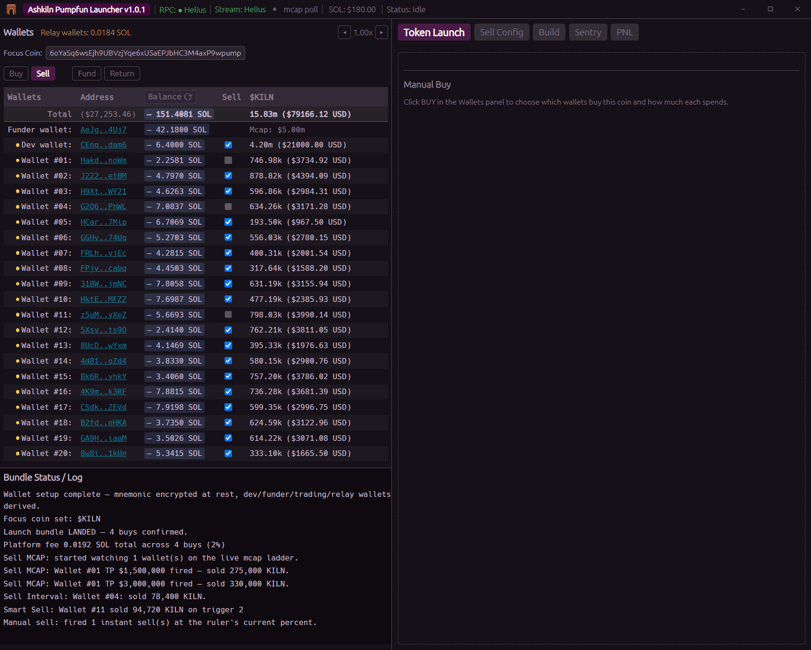
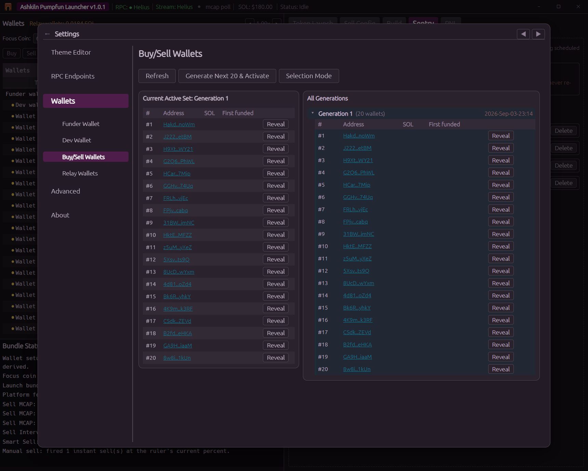
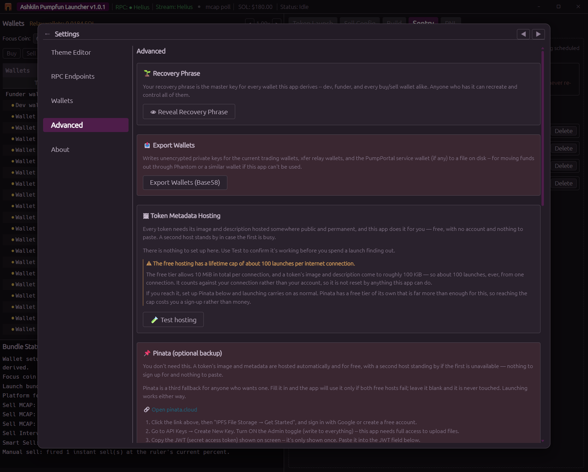

# Wallets

## One phrase, many wallets

Everything comes from a single 12 word BIP-39 recovery phrase. The app derives each wallet from it
on the standard Solana path (`m/44'/501'/N'/0'`), the same one Phantom, Solflare and
`solana-keygen` use, so any address here can be opened in an ordinary wallet if you ever need to.

No derived private key is ever stored. Each one is worked out again in memory when you unlock and
wiped when the app closes. The phrase, encrypted, is all the app needs on disk to rebuild them.

A key you import yourself is the one thing that works differently. Nothing can work it out from your
phrase, so the app keeps that key, encrypted the same way, in `settings\.env`. The practical
difference is what your 12 words are worth: they restore every wallet the app derived, but they will
not restore an imported one. See *Funding by importing a wallet you already have* below.

## The roles

| Wallet | How many | What it does |
|---|---|---|
| **Funder** | 1 | Holds your SOL and pays out to everything else. The one you send SOL to from outside. |
| **Dev** | 1 | Creates the coin. It is the coin's on chain creator, and can buy in the launch bundle too. |
| **Trading** | 20 | The wallets that buy and sell. |
| **Relay** | 20 | One paired to each trading wallet. Used only to pass SOL along; you never trade from them. |

You can switch any of these for a different one later, see *Changing your wallet set* below.

## The relay hop

When you fund a trading wallet, the SOL does not go straight there. It goes
**funder → relay wallet → trading wallet**, and back the same way when you return it. The dev wallet
is funded directly.

This is so your trading wallets are not one hop from your funder in a block explorer.

**Be realistic about what it buys you.** It breaks the obvious direct link. It does not defeat
serious chain analysis: **the hops happen back to back, with no deliberate delay**, so the timing
still correlates them. Treat it as tidiness, not anonymity.

Optional random delays between hops are planned for a future version.

## Funding

1. Send SOL to the **funder** address from wherever you keep it. Click any address to copy it.
2. Press **Refresh Balances**.
3. Switch the panel to **FUND**.
4. Type an amount in the box above the table and press **Set Amount** to copy it into every ticked
   wallet, or type per wallet amounts by hand.
5. Press **Fund wallets**.

Real transactions, no undo. A ticked wallet with an empty or invalid amount is skipped and logged
rather than blocking the rest.

### Funding by importing a wallet you already have

You do not have to start with an empty funder. If you already hold SOL in Phantom or Solflare, you
can import that wallet's private key and use it as the funder directly, so it arrives already
funded and you skip the first transfer entirely.

**Settings, Wallets, Funder, then Import Custom Private Key.** Paste the base58 private key, which
is the format Phantom exports. The same button sits on the **Dev** tab.

**Only the funder and the dev wallet can be imported.** The 20 trading wallets and their 20 relays
are always derived from your recovery phrase, as a set, and nothing can import into them. Fund those
from the funder in the normal way above.

**This is the one key the app has to keep a copy of.** A key you imported did not come from your
phrase, so it cannot be worked out again. It is encrypted in memory the moment you paste it, using
the same AES-256-GCM and Argon2id under the same passphrase that protects your phrase, and only the
encrypted result is written to `settings\.env`. Plain key material never reaches the disk. It
survives a restart, and changing your passphrase encrypts it again under the new one.

**One imported wallet per role**, so one funder and one dev at most. Importing again replaces the
previous one. While an imported wallet is active, **Create Next** and **Switch** are turned off for
that role.

**Remove Custom** puts the derived wallet back and **deletes the imported key from the app for
good.** Keep the wallet in Phantom, or write the key down, before you press it. Note also that
**Export Wallets (Base58) does not include an imported funder or dev key**, only the trading and
relay wallets.

### Getting it back

Switch to **RETURN**.

- **Return Selected** sends each ticked wallet's typed amount back to the funder.
- **Sweep to Funder** sends *every* trading wallet's *entire* balance back, ignoring the checkboxes.

## Two different "keep some back" numbers

These get confused, so they are worth separating.

**The sell buffer, SOL, automatic, set once.** Each wallet keeps a small amount of SOL (0.01 by
default) that a buy is never allowed to eat into. It exists because selling later costs money: the
transaction fee, the wallet's rent exempt minimum, and roughly 0.007 SOL of one off account setup
the first time a wallet touches a brand new coin. The BUY column clamps against it for you and shows
the real maximum you can spend. A wallet that spends its buffer can end up holding tokens it cannot
afford to sell.

**The Reserve. Tokens, per sell job, you choose.** In Sell Config, the Reserve is how much of the
coin a sell job must leave behind and never sell. Either a percentage of the position or a fixed
token count. Set it to 0 to sell everything.

## The minimum trade

**0.01 SOL, on every buy and every sell.** It is built into the app and cannot be changed.

The reason is rent: the first time a wallet buys a new coin it pays roughly 0.004 SOL to open its
token account. Below the minimum, the setup costs more than the trade. Anything smaller is refused
at the point where you type it.

## The Focus Coin

The Focus Coin is the one coin the app is pointed at. Paste a mint address into the field at the top
of the Wallets panel and press Enter; a launch sets it for you automatically.

With a Focus Coin set, every wallet row gains a column showing how much of that coin it holds, and
the Sell side of the app becomes usable.

**It also changes what Refresh Balances does**, which is worth knowing:

- **No Focus Coin**, a full scan of every token every wallet holds. That is two requests per
  wallet, around 44 on a full pool, and it is the call free RPC endpoints throttle hardest. This is
  what fills in the "holds other tokens" dot and the per wallet token list you get by clicking a
  wallet's name.
- **A Focus Coin set**, SOL plus that one coin, in a single request. Fast, and it will not trip a
  rate limit.

So if the holdings dots look stale, clear the Focus Coin and refresh. There is deliberately no
second button for it.

## Backing up

**Settings → Advanced → Recovery Phrase** reveals your 12 words again, behind your passphrase. This
is the backup that matters. Write it on paper.

**Settings → Advanced → Export Wallets** writes a file of every wallet's private key into the
`exports` folder. It is **not encrypted**, it is a plain key file, exactly the thing you would
never normally let touch a disk. Useful if you want to import a wallet elsewhere. Delete it when
you're done, and never put it in a synced folder.

**Reveal Private Key** on any individual wallet does the same for one address, behind your
passphrase.

## Changing your passphrase

**Change Passphrase**, on the unlock screen. It encrypts again the phrase under the new passphrase.
Your wallets and addresses do not change, only the lock on the file.

The same strength meter applies here as at setup: the new passphrase has to reach **Fair** before
the app will accept it. Spaces are not allowed, here or anywhere else the app asks for your
passphrase.

## Changing your wallet set

**Settings → Wallets** has a tab per role.

- **Funder** and **Dev**, Create Next moves to the next unused address in that role's range, Switch
  moves to any index, Import Custom brings in an outside key. Changes take effect immediately, no
  restart. Switching a dev wallet that still holds SOL or tokens warns you first.
- **Buy/Sell**, **Generate Next 20 & Activate** derives a fresh set of 20 trading wallets and
  installs them live. Blocked while a launch or any sell or buy job is running.
- **Relay**, read only balance oversight, plus a button to sweep every relay wallet back to the
  funder if any SOL gets stranded there.

Every one of these is still derived from the same recovery phrase. Nothing here creates a wallet
your phrase cannot recover.

## Two more things the funder can do

**Withdraw SOL** (Settings → Wallets → Funder) sends SOL from your funder to any address you paste.
It is the only place in the app that pays out to an address it holds no key for, and it is
irreversible, check the address twice.

**Reclaim All Rent** (Settings → Advanced) scans every dev and trading wallet for empty token
accounts and closes them, returning roughly 0.002 SOL each to the wallet that paid it. It previews
what it found before it does anything. Worth running after you've finished with a batch of coins.

